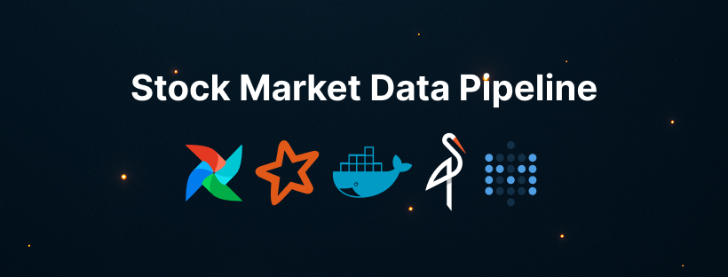
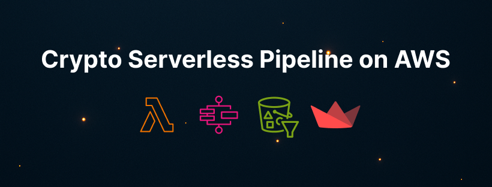
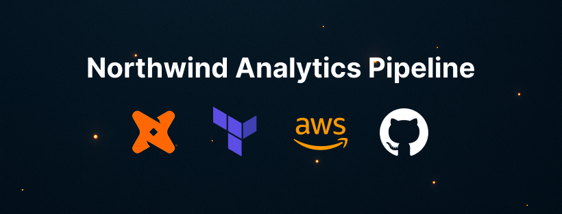

# 
👷‍♂️ Data Engineer in Practice – Bruno Chiconato 

**Turning raw data into clean, automated, and observable pipelines using modern cloud & open-source stacks.**

Current role: BI Analyst Jr. (👀), but delivering like a full-stack data engineer.

> *I make data pipelines that don't cry at 2 AM.*

## 👋 About Me

I'm Bruno, a Data Engineer in practice (and in mindset).
Despite the “BI Analyst” title on paper, I spend my days solving real data engineering problems:
broken pipelines, poorly structured data lakes, unscalable ETLs, lack of observability — and turning them into robust, modular, and automated solutions.

I’ve built and deployed **serverless and open-source data pipelines** from scratch, using tools like **Apache Airflow**, **AWS Lambda**, **Docker**, **Spark**, **dbt**, **Step Functions**, and **MinIO**, with data visualized in **Metabase** or **Streamlit**, and monitored via **Slack/SNS**.

My focus:
**Architecture first, automation always, cloud when needed, and code that doesn’t cry in production.**

Currently pursuing a postgrad in Data Engineering while shipping personal projects that reflect real-world complexity.

## Tech Stack Snapshot

  <!-- Python -->
  
  <!-- Linux -->
  
  <!-- Docker -->
  
  <!-- Terraform -->
  
  <!-- AWS -->
  
  <!-- Git -->
  
  <!-- Airflow -->
  
  <!-- dbt -->
  
  <!-- MySQL -->
  
  <!-- PostgreSQL -->
  
  <!-- SQL Server -->
  

## Featured Projects

### Stock Market Data Pipeline with Apache Airflow, Spark & MinIO

End-to-end orchestrated pipeline using an open-source stack for financial data processing and dashboarding.

* Built with **Apache Airflow (Astro CLI)**, containerized via **Docker Compose**.
* Ingests stock data from Yahoo Finance API, stores raw JSON in **MinIO (S3-compatible)**.
* Transforms data using **Apache Spark**, writes cleaned CSVs back to object storage.
* Loads final tables into **PostgreSQL**, visualized with **Metabase** dashboards.
* Integrates **Slack notifications** for monitoring pipeline success/failure.
* Focused on orchestration, transformation, and delivery with modular DAGs and TaskFlow API.

> *"This project simulates a production-grade ELT architecture using only open-source tools. It demonstrates my proficiency with Airflow orchestration, Spark processing, and cloud-native design principles."*

🔗 [Link to Repository](https://github.com/BrunoChiconato/airflow-project)

---

### Cryptocurrency Serverless Pipeline on AWS

Real-time, cost-optimized pipeline for crypto data ingestion, transformation, alerting, and visualization — fully serverless.

* Automated ingestion every 5 minutes via **EventBridge** triggering **Step Functions**.
* Built with **6 AWS Lambda Functions** for fetch, validation, transformation, and notification.
* Raw and transformed data stored in **S3 (Parquet format)**.
* Dashboard built using **Streamlit**, deployed on **EC2**, visualizing historical and real-time metrics.
* Integrated alerting via **SNS Email Notifications** based on pipeline execution state.
* Designed for **free-tier compliance** and scalability with no servers to manage.

> *"This project shows how I design scalable and efficient data pipelines using the AWS serverless ecosystem, with strong emphasis on automation, resilience and low cost."*

🔗 [Link to Repository](https://github.com/BrunoChiconato/aws-bootcamp/tree/main/aula_14)

---

### Northwind Analytics Pipeline

A fully automated analytics pipeline built with **dbt**, **AWS Fargate**, and **Terraform** to demonstrate modern DataOps practices.

* Manages all cloud infrastructure as code using **Terraform** to provision the AWS environment.
* Automates data transformation and testing via a **CI/CD pipeline** with **GitHub Actions**.
* Executes dbt jobs in a containerized, **serverless environment** on **AWS Fargate**, eliminating the need to manage servers.
* Features integrated data quality testing and automatically generates and hosts documentation (`dbt docs`) on **S3**.
* Ensures secure credential management with **AWS SSM Parameter Store**.

> *"This project is a blueprint for modern DataOps. It demonstrates my ability to architect and automate a complete analytics workflow, from infrastructure deployment with Terraform to CI/CD-driven transformations with dbt and GitHub Actions, ensuring a scalable, testable, and serverless solution."*

🔗 [Link to Repository](https://github.com/BrunoChiconato/dbt-analytics-pipeline)

## Education & Certifications

-  – Focused on distributed systems, cloud pipelines, data modeling, big data frameworks, and streaming architecture.
-  – Developed strong foundations in systems thinking, logic, and mathematical modeling.
-  – Applied Airflow, dbt, and AWS tools to solve real-world data challenges in hands-on projects.
-  – Certified in DAG architecture, scheduling lifecycle, task execution, and UI-based monitoring & debugging.
-  – Strong command of Python scripting, data manipulation, and functional programming patterns.
-  – Built, deployed, and managed containerized environments, focused on pipeline automation and infrastructure reproducibility.

## GitHub Stats

  

  

<picture align="center">
  <source
    media="(prefers-color-scheme: dark)"
    srcset="https://raw.githubusercontent.com/BrunoChiconato/BrunoChiconato/main/dist/github-snake-dark.svg" />
  <source
    media="(prefers-color-scheme: light)"
    srcset="https://raw.githubusercontent.com/BrunoChiconato/BrunoChiconato/main/dist/github-snake.svg" />
  
</picture>

## Connect with Me

  
  

